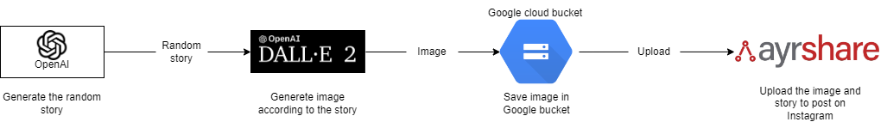

# PythonScript-InstagramPostAI
Python script to publish and generate posts for Instagram through OpenAI


<h2> Introduction </h2>
In November 2022 OpenAI DALL-E released public APIs to generate images according to text descriptions. This python script can be used to publish an Instagram post auto-generated through OpenAI and DALL-E APIs. The generated image is saved in a Google cloud storage bucket, and it is published immediately on Instagram through Ayrshare Apis.

<h2> Description </h2>
This is a python script to autogenerate and publish new original posts and captions on Instagram through differnet APIs. <br>
This python script has been designed to be used as cronjob, in this way it is possible to auto schedule the execution (captions and image generation and Instagram publishing) periodically at fixed times.<br>
For this script I used the following APis: <br>

- OpenAI: to generate “a story about a random topic”. It was necessary to specify “random topic” to get different stories each execution. <br>
API guidelines here: https://beta.openai.com/docs/introduction

- DALL-E: DALL-E is a new AI system that can create realistic images and art from a description in natural language provided by OpenAI. It generates an original image according to the story previously created.<br>
API guidelines here: https://beta.openai.com/docs/guides/images

- Google cloud storage: the image is saved in a Google cloud storage bucket.<br>
API guidelines here: https://cloud.google.com/storage/docs/creating-buckets

- Ayrshare: to auto-publish the images and the captions on Instagram.
API guidelines here: https://docs.ayrshare.com/


<h2>&#x1F53A; Warning &#x1F53A; </h2>
According to DALL-E website https://openai.com/blog/dall-e-api-now-available-in-public-beta/ the DALL-E APIs are now available in beta version. To use them in python it is necessary to use a python version higher than 3 to install DALL-E packages.<br>
Follow these steps:<br>

```
#install the dependencies 
pip install requests
pip install openai
pip install google
pip install social-post-api

#run the cronjob on linux server
crontab -e
#run and log the script every 72 hours
0 */72 * * * cd /path && python DalleInstagramScript.py > /var/log/dalle_`date +\%Y\%m\%d\%H\%M\%S`-log.txt 2>&1
```


<h2> Images </h2>

APIs flow diagram


